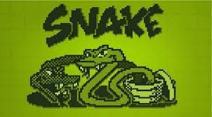
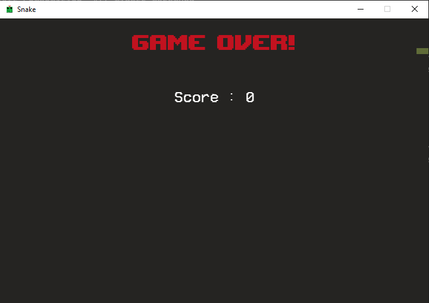

# Snake Game


A snake game made in python using [pygame](https://www.pygame.org/news) library

## About the game

This game is inspired by the classic snake game which used to come pre-installed in most of the featured nokia phone during the late 1970s.



In this game you can use your **WASD** or **arrow keys** on your keyboard to move around a screen. To score points you need to eat the food block which spawns randomly on the screen. For every food block eaten +1 point is awarded followed by a increase in the length of the snake. The game ends when the following conditions are encountered : 
- the player presses the **Esc** key 
- snake hits a wall 
- snake touches its body 
- user closes the game window

---

<div align = "center">



Screenshot of Game Over screen
</div>

___

## How to use

`note : please make sure you are in the correct working directory`

### step 1

>install the prequesities
using the command given below :

```bash
# using pip
python -m pip install -r requirements.txt

# OR

# using pipenv with the help of pipfile.lock
python -m pip install pipenv
pipenv install
```

### step 2

>running the game :

```bash
python main.py
```

___

## contributing

pull requests are welcome.

---
<div class="myDiv" align ="center">


</div>

---
